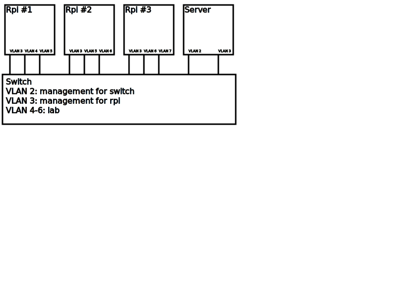

# 在线实验系统设计（草案）

## 实际网络拓扑

## 在线测试流程

1. 编译代码，静态编译
2. 按照拓扑，分配树莓派，下发交换机配置（SNMP？Telnet？）
3. 把对应的网卡隔离到特定的 netns 中，建立容器环境
4. 运行用户程序和预定义的脚本，收集输出信息
5. 分析并上传输出信息

## 交换机 VLAN 配置

配置方法：
方案1: 通过 SNMP 配置 VLAN（[Cisco](https://www.cisco.com/c/en/us/support/docs/ip/simple-network-management-protocol-snmp/45080-vlans.html) [Huawei](http://oidref.com/1.3.6.1.4.1.2011.5.25.42.3.1.1.1.1.3)）
方案2: 通过 SSH/Telnet/Serial 敲命令进行配置

配置拓扑：
方案1: 交换机之间用 trunk 桥接起来，共用一个 vlan 空间。优点是树莓派分配可以比较随意，缺点是比较麻烦，需要配置一或两个交换机。
方案2: 每个交换机内设 vlan。优点是配置比较简单，缺点是需要知道每个树莓派和交换机的位置关联和分配树莓派时范围较小。
