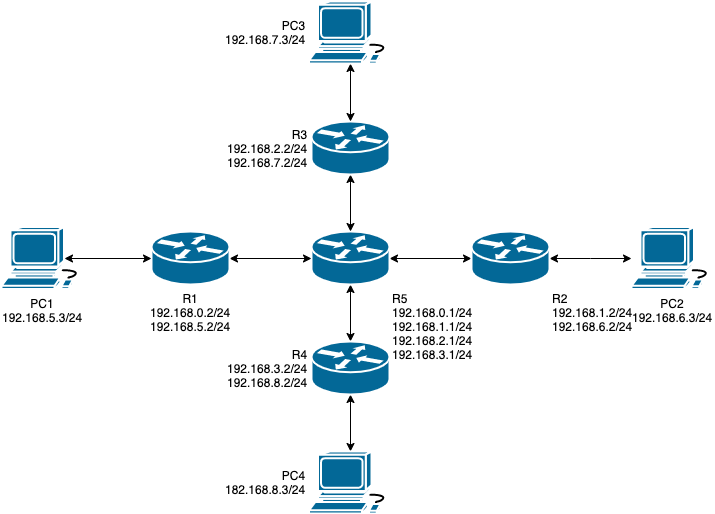

# 计算机网络原理与计算机组成原理联合实验

## 实验验收基础要求

测试方法（满足部分即可拿到满分，超过满分部分舍去）：

1. 连通性（10%）：PC1-4 两两之间可以互相 `ping` 通
2. 单链接单工：在 PC1 运行 `iperf3 -s`，在 PC2 运行 `iperf3 -c 192.168.5.3`，默认参数运行，带宽不低于 70Mbps （15%），不低于 90Mbps（20%）
3. 双链接单工：在 PC2 运行 `iperf3 -s`，在 PC3 运行 `iperf3 -s`，同时在 PC1 运行 `iperf3 -c 192.168.6.3` 和在 PC4 运行 `iperf3 -c 192.168.7.3`，默认参数运行，带宽之和不低于 100 Mbps（10%），不低于 150Mbps （15%），不低于 180Mbps（20%）
4. 双链接双工：在 PC1-4 运行 `iperf3 -s`，同时在 PC1 运行 `iperf3 -c 192.168.6.3` ，在 PC1 运行 `iperf3 -c 192.168.6.3` 在 PC2 运行 `iperf3 -c 192.168.5.3` 在 PC3 运行 `iperf3 -c 192.168.8.3` 在 PC4 运行 `iperf3 -c 192.168.7.3`，默认参数运行，带宽之和不低于 150 Mbps（20%），不低于 250Mbps （25%），不低于 350Mbps（30%）
5. 单链接单工小包：在 PC2 运行 `iperf3 -s`，在 PC1 运行 `iperf3 -c 192.168.6.3 -u -l 16 -t 5 -b 1G`，在 PC2 计算 0.00-5.00 秒总共的 `(Total Datagrams - Lost) / 5s` ，不低于 1K（5%），不低于 5K（10%），不低于 25K（15%），不低于 50K（20%），不低于 100K（30%）
6. 小规模路由表压力测试（10%）：在 R1 上额外配置 192.168.10.0/24 ~ 192.168.255.0/24 共 246 条新的路由，保证 RIP 协议运行的正确性
7. 中等规模路由表压力测试（15%）：在 R1 R2 R3 R4 上分别配置 10.1.0.0/24 ~ 10.2.255.0/24，10.3.0.0/24 ~ 10.4.255.0/24，10.5.0.0/24 ~ 10.6.255.0/24，10.7.0.0/24 ~ 10.8.255.0/24 共 2048 条新路由，保证 RIP 协议运行和转发功能的正确性
8. 较大规模路由表压力测试（20%）：在 R1 上配置 AS4538 的所有 IPv4 路由（约 5000 条），保证 RIP 协议运行和转发功能的正确性
9. 其他扩展功能：经助教和老师同意可以获得每项不高于 10% 的分数

