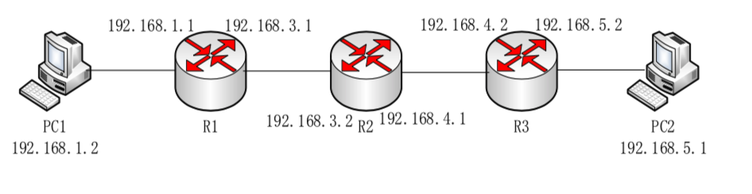

# Router-Lab

最后更新：2019/12/22 4:20 p.m.

<details>
    <summary> 目录 </summary>

* [如何使用框架](#如何使用框架)
    * [如何使用 HAL](#如何使用-hal)
    * [HAL 提供了什么](#hal-提供了什么)
    * [各后端的自定义配置](#各后端的自定义配置)
* [如何进行本地自测](#如何进行本地自测)
* [如何进行在线测试（暗号：框）](#如何进行在线测试暗号框)
* [实验验收的流程](#实验验收的流程)
    * [实验第一部分](#实验第一部分)
    * [实验第二部分](#实验第二部分)
    * [实验第三部分](#实验第三部分)
* [建议的实验思路](#建议的实验思路)
    * [如何启动并配置一个比较标准的 RIP 实现](#如何启动并配置一个比较标准的-rip-实现)
    * [如何在一台计算机上进行真实测试](#如何在一台计算机上进行真实测试)
* [FAQ（暗号：档）](#faq暗号档)
* [附录：ip 命令的使用](#附录ip-命令的使用)
* [附录：树莓派系统的配置和使用](#附录树莓派系统的配置和使用)
* [附录： make 命令的使用和 Makefile 的编写](#附录-make-命令的使用和-makefile-的编写)
* [附录：出现问题如何调试](#附录出现问题如何调试)
* [名词解释](#名词解释)
* [项目作者](#项目作者)

</details>


这里是 2019 年网络原理课程原理课程实验采用的框架。它有以下的设计目标：

1. 降低难度，把与底层打交道的部分抽象成通用的接口，减少学习底层 API 的负担
2. 复用代码，在一个平台上编写的程序可以直接用于其他平台
3. 方便测试，提供文件读写 PCAP 的后端，可以直接用数据进行黑箱测试

实验的目标是完成一个具有以下功能的路由器：

1. 转发：收到一个路过的 IP 包，通过查表得到下一棒（特别地，如果目的地址直接可达，下一棒就是目的地址），然后“接力”给下一棒。
2. 路由：通过 RIP 协议，学习到网络的拓扑信息用于转发，使得网络可以连通。

请仔细阅读下面的文本，在问问题时，请把以下每个括号中的 **暗号** 按顺序连在一起重复一遍然后再说你的问题。

本文档默认你已经在软件工程、编译原理、程序设计训练等课程中已经学习到了足够的 Git 、Make 、SSH 、Python3 和 Linux 的使用知识。如果你用的是 Windows 系统，你可以 WSL/虚拟机/下发的树莓派上进行以下所有相关的操作。无论你电脑是用的是什么系统，最终都需要在树莓派的 Linux 上运行路由器。

如果你运行的是 Debian 系列发行版（包括 Ubuntu、Raspbian），你可以一把梭地安装所有可能需要的依赖：

```bash
sudo apt install git make cmake python3 python3-pip libpcap-dev libreadline-dev libncurses-dev wireshark tshark iproute2 g++
pip3 install pyshark
```

其他发行版也有类似的包管理器安装方法。


## 如何使用框架

这个框架主要分为两部分，一部分是硬件抽象层，即 HAL （Hardware Abstraction Layer），它提供了数个后端，可以在不修改用户代码的情况下把程序运行在不同的平台上；另一部分是数个小实验，它们对你所需要实现的路由器的几个关键功能进行了针对性的测试，采用文件输入输出的黑盒测试方法，在真机调试之前就可以进行解决很多问题。

（暗号：我）

第一步是克隆本仓库：

```shell
git clone https://github.com/z4yx/Router-Lab.git
cd Router-Lab
git submodule update --init --recursive
```

如果到 GitHub 的网络情况不好，也可以从 `https://git.tsinghua.edu.cn/Router-Lab/Router-Lab.git` 克隆，我们会保证两个地址内容一致。

之后如果这个仓库的代码有什么更新，请运行 `git pull` 进行更新。

### 如何使用 HAL

在 `HAL` 目录中，是完整的 HAL 的源代码。它包括一个头文件 `router_hal.h` 和若干后端的源代码。

如果你有过使用 CMake 的经验，那么建议你采用 CMake 把 HAL 和你的代码链接起来。编译的时候，需要选择 HAL 的后端，可供选择的一共有：

1. Linux: 用于 Linux 系统，基于 libpcap，发行版一般会提供 `libpcap-dev` 或类似名字的包，安装后即可编译。
2. macOS: 用于 macOS 系统，同样基于 libpcap，安装方法类似于 Linux 。
3. stdio: 直接用标准输入输出，也是采用 pcap 格式，按照 VLAN 号来区分不同 interface。
4. Xilinx: 在 Xilinx FPGA 上的一个实现，中间涉及很多与设计相关的代码，并不通用，仅作参考，对于想在 FPGA 上实现路由器的组有一定的参考作用。（暗号：认）

后端的选择方法如下（在 Router-Lab 目录下执行）：

```bash
mkdir build
cd build
cmake .. -DBACKEND=Linux
make router_hal # 编译 HAL 库，生成 ./HAL/librouter_hal.a
make capture # 编译 Example 中的 capture，生成 ./Example/capture
make # 编译 HAL 库和所有 Example
```

其它后端类似设置即可。

如果你不想用 CMake ，你可以直接把 `router_hal.h` 放到你的 Header Include Path 中，然后把对应后端的文件（如 `HAL/src/linux/router_hal.cpp`）编译并链接进你的程序，同时在编译选项中写 `-DROUTER_BACKEND_LINUX` （即 ROUTER_BACKEND_ 加上后端的大写形式）。可以参考 `Homework/checksum/Makefile` 中相关部分。

在这个时候，你应该可以通过 HAL 的编译。

特别地，由于 Linux/macOS 后端需要配置 interface 的名字，默认情况下采用的是 `eth1-4`（macOS 则是 `en0-3`） 的命名，如果与实际的不符（可以采用 `ifconfig` 或者 `ip a` 命令查看），可以直接修改 `HAL/src/linux/platform/standard.h`（macOS 则是 `HAL/src/macOS/router_hal.cpp`） 或者修改 `HAL/src/linux/platform/testing.h` 并在编译选项中打开 `-DHAL_PLATFORM_TESTING` 进行配置。如果配置不正确，可能会出现一些接口永远收不到，也发不出数据的情况。

### HAL 提供了什么

HAL 即 Hardware Abstraction Layer 硬件抽象层，顾名思义，是隐藏了一些底层细节，简化同学的代码设计。它有以下几点的设计：

1. 所有函数都设计为仅在单线程运行，不支持并行
2. 从 IP 层开始暴露给用户，由框架处理 ARP 和收发以太网帧的具体细节
3. 采用轮询的方式进行 IP 报文的收取
4. 尽量用简单的方法实现，而非追求极致性能

它提供了以下这些函数：

1. `HAL_Init`: 使用 HAL 库的第一步，**必须调用且仅调用一次**，需要提供每个网口上绑定的 IP 地址，第一个参数表示是否打开 HAL 的测试输出，十分建议在调试的时候打开它
2. `HAL_GetTicks`：获取从启动到当前时刻的毫秒数
3. `HAL_ArpGetMacAddress`：从 ARP 表中查询 IPv4 地址对应的 MAC 地址，在找不到的时候会发出 ARP 请求
4. `HAL_GetInterfaceMacAddress`：获取指定网口上绑定的 MAC 地址
5. `HAL_ReceiveIPPacket`：从指定的若干个网口中读取一个 IPv4 报文，并得到源 MAC 地址和目的 MAC 地址等信息；它还会在内部处理 ARP 表的更新和响应，需要定期调用
6. `HAL_SendIPPacket`：向指定的网口发送一个 IPv4 报文

这些函数的定义和功能都在 `router_hal.h` 详细地解释了，请阅读函数前的文档。为了易于调试，HAL 没有实现 ARP 表的老化，你可以自己在代码中实现，并不困难。

仅通过这些函数，就可以实现一个软路由。我们在 `Example` 目录下提供了一些例子，它们会告诉你 HAL 库的一些基本使用范式：

1. Shell：提供一个可交互的 shell ，可能需要用 root 权限运行，展示了 HAL 库几个函数的使用方法，可以输出当前的时间，查询 ARP 表，查询端口的 MAC 地址，进行一次抓包并输出它的内容，向网口写随机数据等等；它需要 `libncurses-dev` 和 `libreadline-dev` 两个额外的包来编译
2. Broadcaster：一个粗糙的“路由器”，把在每个网口上收到的 IP 包又转发到所有网口上（暗号：真）
3. Capture：仅把抓到的 IP 包原样输出

如果你使用 CMake，可以从上面编译 HAL 库的部分找到编译这三个例子的方法。如果不想使用 CMake，可以基于 `Homework/checksum/Makefile` 修改出适合例子的 Makefile 。它们可能都需要 root 权限运行，并在运行的时候你可以打开 Wireshark 等抓包工具研究它的具体行为。

这些例子可以用于检验环境配置是否正确，如 Linux 下网卡名字的配置、是否编译成功等等。比如在上面的 Shell 程序中输入 `mac 0` `mac 1` `mac 2` 和 `mac 3`，它会输出对应网口的 MAC 地址，如果输出的数据和你用 `ip l`（macOS 可以用 `ifconfig`） 看到的内容一致，那基本说明你配置没有问题了。

你也可以利用 HAL 本身的调试输出，只需要在运行 `HAL_Init` 的时候设置 `debug` 标志 ，你就可以在 stderr 上看到一些有用的输出。

#### 各后端的自定义配置

各后端有一个公共的设置  `N_IFACE_ON_BOARD` ，它表示 HAL 需要支持的最大的接口数，一般取 4 就足够了。

在 Linux 后端中，一个很重要的是 `interfaces` 数组，它记录了 HAL 内接口下标与 Linux 系统中的网口的对应关系，你可以用 `ip l` 来列出系统中存在的所有的网口。为了方便开发，我们提供了 `HAL/src/linux/platform/{standard,testing}.h` 两个文件（形如 a{b,c}d 的语法代表的是 abd 或者 acd），你可以通过 HAL_PLATFORM_TESTING 选项来控制选择哪一个，或者修改/新增文件以适应你的需要。

在 macOS 后端中，类似地你也需要修改 `HAL/src/macOS/router_hal.cpp` 中的 `interfaces` 数组，不过实际上 `macOS` 的网口命名方式比较简单，所以一般不用改也可以碰上对的。

## 如何进行本地自测

在 `Homework` 目录下提供了若干个题目，通过数据测试你的路由器中核心功能的实现。你需要在被标记 TODO 的函数中补全它的功能，通过测试后，就可以更容易地完成后续的实践。

有这些目录：

```
checksum： 计算校验和
forwarding： 转发逻辑
lookup： 路由表查询和更新
protocol： RIP 协议解析和封装
boilerplate： 用以上代码实现一个路由器
```

每个题目都有类似的结构（以 `checksum` 为例）：

```
data： 数据所在的目录
checksum.cpp：你需要修改的地方
grade.py：一个简单的评分脚本，它会编译并运行你的代码，进行评测
main.cpp：用于评测的交互库，你不需要修改它
Makefile：用于编译并链接 HAL 、交互库和你实现的代码
```

使用方法（在 Homework/checksum 目录下执行）：

```bash
pip install pyshark # 仅第一次，一些平台下要用 pip3 install pyshark
# 修改 checksum.cpp（暗号：读）
make # 编译，得到可以执行的 checksum
./checksum < data/checksum_input1.pcap # 你可以手动运行来看效果
make grade # 也可以运行评分脚本，实际上就是运行python3 grade.py
```

它会对每组数据运行你的程序，然后比对输出。如果输出与预期不一致，它会把出错的那一个数据以 Wireshark 的类似格式打印出来，并且用 diff 工具把你的输出和答案输出的不同显示出来。

这里很多输入数据的格式是 PCAP ，它是一种常见的保存网络流量的格式，它可以用 Wireshark 软件打开来查看它的内容，也可以自己按照这个格式造新的数据。需要注意的是，为了区分一个以太网帧到底来自哪个虚拟的网口，我们所有的 PCAP 输入都有一个额外的 VLAN 头，VLAN 0-3 分别对应虚拟的 0-3 ，虽然实际情况下不应该用 VLAN 0，但简单起见就直接映射了。（暗号：了）

## 如何进行在线测试（暗号：框）

选课的同学还需要在 OJ 上进行你的代码的提交，它会进行和你本地一样的测试，数据也基本一致。你提交的代码会用于判断你掌握的程度和代码查重。

一般来说，你只需要把你修改的函数的整个文件提交到对应题目即可，如 `Homework/checksum/checksum.cpp` 提交到 `checksum` 题目中。如果通过了测试，你实现的这个函数之后就可以继续用在你的路由器的实现之中。

需要注意的是，测试采用的数据并不会面面俱到，为了减少在真实硬件（如树莓派、FPGA）上调试的困难，建议同学们自行设计测试样例，这样最终成功的可能性会更高。

## 实验验收的流程

实验一共有三个部分的要求，第一部分是实现 `Homework` 下面的几个题目，要求在 OJ 上提交并通过；第二部分是针对个人的测试，主要测试转发和RIP协议的细节；第三部分是针对组队的测试，只要保证连通性，即可通过，如果采用更加复杂的网络拓扑也能达到预期目标，可以得到加分。

<details>
    <summary> CIDR 表示方法 </summary>

下面多次用到了 CIDR 的表示方法，格式是 a.b.c.d/len ，可能表示以下两种意义之一：

1. 地址是 a.b.c.d ，并且最高 len 位和 a.b.c.d 相同的 IP 地址都在同一个子网中，常见于对于一个网口的 IP 地址的描述。如 192.168.100.14/24 表示 192.168.100.14 的地址，地址掩码为 255.255.255.0 ，183.173.233.233/17 表示 183.173.233.233 的地址，地址掩码为 255.255.128.0 。
2. 描述一个地址段，此时 a.b.c.d 除了最高 len 位都为零，表示一个 IP 地址范围，常见于路由表。如 192.168.100.0/24 表示从 192.168.100.0 到 192.168.100.255 的地址范围，183.173.128.0/17 表示从 183.173.128.0 到 183.173.255.255 的地址范围。

</details>

### 实验第一部分

实验的第一部分目前共有四道题，要求同学们独立完成，助教会对代码进行人工检查和查重。需要实现的函数功能都在函数的注释中进行了阐述，评测所采用的数据都公开，如果出现了本地自测通过但在 OJ 上测试不通过的情况请找助教。

### 实验第二部分

实验的第二部分是针对个人的测试，你需要把你的软件运行在树莓派上，和我们提供的机器组成如下的拓扑：



这一阶段，PC1、R1、R3、PC2 都由助教提供，两台路由器上均运行 BIRD 作为标准的路由软件实现。你的树莓派在 R2 的位置。其中 R2 实际用到的只有两个口，剩余两个口配置为 `10.0.2.1/24` 和 `10.0.3.1/24` 。初始情况下，R1 和 R3 先不启动 RIP 协议处理程序，这些机器的系统路由表如下：

```
PC1:
default via 192.168.1.1 dev pc1r1
192.168.1.0/24 dev pc1r1 scope link
R1:
192.168.1.0/24 dev r1pc1 scope link
192.168.3.0/24 dev r1r2 scope link
R3:
192.168.4.0/24 dev r3r2 scope link
192.168.5.0/24 dev r3pc2 scope link
PC2:
default via 192.168.5.2 dev pc2r3
192.168.5.0/24 dev pc2r3 scope link
```

上面的每个网口名称格式都是两个机器拼接而成，如 `pc1r1` 代表 pc1 上通往 r1 的网口。此时，接上你的树莓派，按照图示连接两侧的 R1 和 R3 后，从 PC1 到 PC2 是不通的。接着，在 R1 和 R3 上都开启 RIP 协议处理程序，它们分别会在自己的 RIP 包中宣告 `192.168.1.0/24` 和 `192.168.5.0/24` 的路由。一段时间后它们的转发表（即直连路由 + RIP 收到的路由）应该变成这样：

```
R1:
10.0.2.0/24 via 192.168.3.2 dev r1r2
10.0.3.0/24 via 192.168.3.2 dev r1r2
192.168.1.0/24 dev r1pc1 scope link
192.168.3.0/24 dev r1r2 scope link
192.168.4.0/24 via 192.168.3.2 dev r1r2
192.168.5.0/24 via 192.168.3.2 dev r1r2
R3:
10.0.2.0/24 via 192.168.4.1 dev r3r2
10.0.3.0/24 via 192.168.4.1 dev r3r2
192.168.1.0/24 via 192.168.4.1 dev r3r2
192.168.3.0/24 via 192.168.4.1 dev r3r2
192.168.4.0/24 dev r3r2 scope link
192.168.5.0/24 dev r3pc2 scope link
```

实际情况下，树莓派的网卡名字的分配规则是插入时选择最小的位被分配的数字，所以在验收的时候先插的是到 R1 的 USB 网卡，对应 eth1 ，然后再插到 R3 的 USB 网卡，对应 eth2 。

我们将会逐项检查下列内容：

* PC1 是否与 PC2 能够正常通信：使用 `ping` 测试 ICMP、在一个 PC 上运行 `nc -l 80`，另一个 PC 上运行 `nc $pc_addr 80` 并输入内容回车测试 TCP 连接
* R2 的转发是否通过 HAL 完成，而非 Linux 自带的路由转发功能：在 R2 上使用 `ip a` 命令确认连接 R1 和 R3 的网口上没有配置 IP 地址
* R1、R3 上的 RIP 路由表是否正确：包括 RIP metric 等信息，从 R1 和 R3 上 运行的 BIRD 输出得到
* R2 向 R1、R3 发出的 RIP 协议报文是否正确：包括是否响应了请求，以及是否实现了水平分裂（split horizon）算法，在 R1 和 R3 上用 Wireshark 抓包检查
* R2 上的 RIP 路由表、转发表是否正确：需要你定期或者每次收到报文时打印最新的 RIP 路由表、系统转发表（见 FAQ 中对于路由表和转发表的讨论），格式自定，可以模仿 `ip route` 的输出格式

在 `Setup` 目录下存放了验收时在 R1 和 R3 上配置的脚本，还有恢复它的改动的脚本，注意它采用了树莓派中管理网络的 dhcpcd 进行地址的配置，所以可能不适用于树莓派以外的环境。如果运行过配置脚本，请在验收前恢复它的改动，运行恢复脚本即可，也可以手动删除 `/etc/dhcpcd.conf` 最后的几行内容然后用 `sudo systemctl restart dhcpcd` 来重启 dhcpcd。简单起见，它采用了 netns 来模拟 PC1 和 PC2，这样只需要两个树莓派就可以进行联调和验收。

<details>
    <summary>为何不在 R2 上配置 IP 地址：192.168.3.2 和 192.168.4.1 </summary>

1. Linux 有自己的网络栈，如果配置了这两个地址，Linux 的网络栈也会进行处理，如 ARP 响应，ICMP 响应和（可以开启的）转发功能
2. 实验中你编写的路由器会运行在 R2 上，它会进行 ARP 响应（HAL 代码内实现）和 ICMP 响应（可选）和转发（你的代码实现），实际上做的和 Linux 网络栈的部分功能是一致的
3. 为了保证确实是你编写的路由器在工作而不是 Linux 网络栈在工作，所以不在 R2 上配置这两个 IP 地址

</details>

必须实现的有：

1. 转发功能，支持直连路由和间接路由，包括查表，TTL 减一，Checksum 更新并转到正确的 interface 出去。
2. 周期性地向所有端口发送 RIP Response （建议在测试和验收时调为 5s），目标地址为 RIP 的组播地址。
3. 对收到的 RIP Request 有相应的 RIP Response 进行回复，目标地址为 RIP Request 的源地址。
4. 实现水平分割（split horizon）。
5. 收到 RIP Response 时，对路由表进行维护。需要注意的是，BIRD 实现了 reverse poisoning ，你需要注意这种情况。
6. 定期或者在更新的时候向 stdout/stderr 打印最新的 RIP 路由表。

可选实现的有（不加分，但对调试有帮助）：

1. 对 ICMP Echo Request 进行 ICMP Echo Reply 的回复。
2. 在查不到路由表的时候，回复 ICMP Host Unreachable。
3. 在 TTL 减为 0 时，回复 ICMP Time Exceeded。
4. 支持 RIP Entry 中 nexthop 不为 0 的情况。
5. 在路由表出现更新的时候发送 RIP Response（完整或者增量），目标地址为 RIP 的组播地址。
6. 在 split horizon 基础上实现 reverse poisoning 。
7. 路由的失效（Invalid）和删除（Flush）计时器。
8. 在发送的 RIP Response 出现不止 25 条 Entry 时拆分。
9. 程序启动时向所有 interface 发送 RIP Request，目标地址为 RIP 的组播地址。

不需要实现的有：

1. ARP 的处理。
2. IGMP 的处理。
3. interface 状态的跟踪（UP/DOWN 切换）。

此外，我们还将使用 `iperf3` 工具分别测试 PC1 和 PC2 双向进行 TCP 传输的速率。如果你的转发性能较高，可以获得额外的加分。同时，我们可能会进行代码和知识点的抽查。

容易出现错误的地方：

1. Metric 计算和更新方式不正确或者不在 [1,16] 的范围内
2. 没有正确处理 RIP Response 特别是 nexthop=0 的处理和 metric=16 的处理，参考 [RFC 2453 Section 4.4 Next Hop](https://tools.ietf.org/html/rfc2453#section-4.4) 和 [RFC 2453 Section 3.9.2 Response Messages](https://tools.ietf.org/html/rfc2453#page-26)
3. 转发的时候查表 not found ，还是路由表有问题
4. 更新路由表的时候，查询应该用精确匹配，但是错误地使用了最长前缀长度匹配
5. 没有对所有发出的 RIP Response 正确地实现水平分割
6. 端序不正确，可以通过 Wireshark 看出

<details>
    <summary> 可供参考的例子 </summary>

我们提供了 `host0.pcap` 和 `host1.pcap` ，分别是在 R1 和 R3 抓包的结果，模拟了实验的过程：

1. 开启 R1 R3 上的 BIRD 和 R2 上运行的路由器实现
2. 使用 ping 进行了若干次连通性测试

注意，这个例子中，路由器只实现了 split horizon，没有实现 reverse poisoning，你的实现不需要和它完全一样。Split horizon 的实现方法见 [RFC2452 3.4.3 Split horizon 第一段](https://tools.ietf.org/html/rfc2453#page-15)。

举个例子，从 PC1 到 PC2 进行 ping 连通性测试的网络活动（忽略 RIP）：

1. PC1 要 ping 192.168.5.1 ，查询路由表得知下一跳是 192.168.1.1 。
2. 假如 PC1 还不知道 192.168.1.1 的 MAC 地址，则发送源地址为 192.168.1.2 的 ARP 请求（通过 pc1r1）询问 192.168.1.1 的 MAC 地址。
3. R1 接收到 ARP 请求，回复 MAC 地址（r1pc1）给 PC1 （通过 r1pc1）。
4. PC1 把 ICMP 包发给 R1 ，目标 MAC 地址为上面 ARP 请求里回复的 MAC 地址，即 R1 的 MAC 地址（r1pc1）。
5. R1 接收到 IP 包，查询路由表得知下一跳是 192.168.3.2 ，假如它已经知道 192.168.3.2 的 MAC 地址。
6. R1 把 IP 包外层的源 MAC 地址改为自己的 MAC 地址（r1r2），目的 MAC 地址改为 192.168.3.2 的 MAC 地址（R2 的 r2r1），发给 R2（通过 r1r2）。
7. R2 接收到 IP 包，查询路由表得知下一跳是 192.168.4.2 ，假如它不知道 192.168.4.2 的 MAC 地址，所以丢掉这个 IP 包。
8. R2 发送源地址为 192.168.4.1 的 ARP 请求（通过 r2r3）询问 192.168.4.2 的 MAC 地址。
9. R3 接收到 ARP 请求，回复 MAC 地址（r3r2）给 R2（通过 r3r2）。
10. PC1 继续 ping 192.168.5.1，查询路由表得知下一跳是 192.168.1.1 。
11. PC1 把 ICMP 包发给 R1 ，目标 MAC 地址为 192.168.1.1 对应的 MAC 地址，源 MAC 地址为 192.168.1.2 对应的 MAC 地址。
12. R1 查表后把 ICMP 包发给 R2，目标 MAC 地址为 192.168.3.2 对应的 MAC 地址，源 MAC 地址为 192.168.3.1 对应的 MAC 地址。
13. R2 查表后把 ICMP 包发给 R3，目标 MAC 地址为 192.168.4.2 对应的 MAC 地址，源 MAC 地址为 192.168.4.1 对应的 MAC 地址。
14. R3 查表后把 ICMP 包发给 PC2，目标 MAC 地址为 192.168.5.1 对应的 MAC 地址，源 MAC 地址为 192.168.5.2 对应的 MAC 地址。
15. PC2 收到后响应，查表得知下一跳是 192.168.5.2 。
16. PC2 把 ICMP 包发给 R3，目标 MAC 地址为 192.168.5.2 对应的 MAC 地址，源 MAC 地址为 192.168.5.2 对应的 MAC 地址。
17. R3 把 ICMP 包发给 R2，目标 MAC 地址为 192.168.4.1 对应的 MAC 地址，源 MAC 地址为 192.168.4.2 对应的 MAC 地址。
18. R2 把 ICMP 包发给 R1，目标 MAC 地址为 192.168.3.1 对应的 MAC 地址，源 MAC 地址为 192.168.3.2 对应的 MAC 地址。
19. R1 把 ICMP 包发给 PC1，目标 MAC 地址为 192.168.1.2 对应的 MAC 地址，源 MAC 地址为 192.168.1.1 对应的 MAC 地址。
20. PC1 上 ping 显示成功。

</details>

### 实验第三部分

第三部分是针对组队的测试，一个组一般是三个人，网络拓扑与单人测试相同，只不过此时 R1、R2、R3 分别是三位同学的树莓派，我们会在验收前几天的某一时刻随机定下每组中哪一位同学分别对应 R1 R2 R3 的哪一个，所以同学们在测试的时候尽量测试各种组合。请注意，在实验中第三部分，在 PC1 R1 R2 R3 PC2 上都不需要运行 BIRD（如果安装了 BIRD 可以运行 `sudo systemctl disable --now bird` 以禁用 BIRD），也不需要打开 Linux 的转发功能。

测试方法（2019.12.20 更新，同学可以选择跳过部分选项，满足部分即可拿到满分，超过满分部分舍去）：

1. 稳定性（15%）：对于下面的测试过程（3-9），如果测试过程中程序没有崩溃，即使没有通过测试，也可以得到每个测试 3% 的分数，15% 封顶
2. 协议基本实现（10%）：R1 可以学到 192.168.5.0/24 的路由，R3 可以学到 192.168.1.0/24 的路由，通过程序输出判断
3. 连通性（10%）：从 PC1 可以 ping 通 PC2
4. 连通延迟（10%）：在连通的基础上，在 PC1 上 ping PC2 的地址， 5s 取延迟的平均值，得到的百分比分值为 10*exp(-t/100) % ，其中 t 单位为 ms
5. 单连接单工大包（30%）：在 PC2 运行 `iperf3 -s`，在 PC1 运行 `iperf3 -c 192.168.5.1`，默认参数运行，得到的百分比分值为 30*(1-exp(-s/20)) % ，其中 s 单位为 Mbps
6. 单链接单工小包（30%）：在 PC2 运行 `iperf3 -s`，在 PC1 运行 `iperf3 -c 192.168.5.1 -u -l 16 -t 5 -b 1G`，在 PC2 计算 0.00-5.00 秒总共的 `(Total Datagrams - Lost) / 5s` ，得到的百分比分值为 30*(1-exp(-s/10)) % ，其中 s 单位为 Kilopackets / s
7. 小规模路由表压力测试（20%）：在 PC1 上开启 bird，配置 192.168.10.0/24 ~ 192.168.255.0/24 共 246 条新的路由，从 PC2 ping 192.168.10.1 （10%）和 192.168.255.1（10%），可以在 PC1 上抓到包
8. 中等规模路由表压力测试（30%）：在 PC1 上开启 bird，10.0.0.0/24 ~ 10.8.255.0/24 共 2048 条新路由，从 PC2 ping 10.1.2.3（15%） 和 10.8.7.6（15%），可以在 PC1 上抓到包
9. 较大规模路由表压力测试（45%）：在 R1 上配置 AS4538 的所有 IPv4 路由（约 5000 条），从 PC2 ping 166.111.4.100 （15%）、101.6.4.100 （15%）和 59.66.134.1（15%），可以在 PC1 上抓到包
10. 其他扩展功能：经助教和老师同意可以获得每项不高于 10% 的分数

为了方便理解，你可以打开 `score.xlsx` 并在里面填入你的数据以计算出你能得到的分数。

PC1 和 PC2 的路由：

```
PC1:
192.168.5.0/24 via 192.168.1.1 dev pc1r1
192.168.1.0/24 dev pc1r1 scope link
PC2:
192.168.1.0/24 via 192.168.5.2 dev pc2r3
192.168.5.0/24 dev pc2r3 scope link
```

初始情况下 R1 R2 R3 都只有对应的直连路由，只有在正确地运行 RIP 协议后，才能从 PC1 ping 通 PC2 。

验收的时候下，由于 PC1 和 PC2 只连接一个 USB 网卡，所以上面的 pc1r1 和 pc2r3 都是 eth1 。同学自由选择 R2 上两个 USB 网卡的插入顺序，但在 R1 上先插到 R2 的 USB 网卡，即 eth1 ，再插到 PC1 的 USB 网卡，即 eth2，在 R3 也是先插到 R2 的网卡，即 eth1 ，再插到 PC2 的 USB 网卡，即 eth2。这样规定的目的是方便替换 PC1/2 的设备，在验收的时候可以从同学自己的电脑直接换成树莓派。

同学在自己测试时，PC1 和 PC2 可以用自己的笔记本电脑，按照上面要求配置两条路由即可测试。配置静态路由的方法参考：[Windows](https://tekbloq.com/2018/10/24/how-to-add-a-static-route-to-the-windows-routing-table/) [macOS](https://blog.remibergsma.com/2012/03/04/howto-quickly-add-a-route-in-mac-osx/) [Linux](https://www.cyberciti.biz/faq/linux-route-add/) 。一般来说，在配置 IP 地址和子网掩码的时候直连路由自动就添加好了，只需要在 PC1 上添加 192.168.5.0/24 via 192.168.1.1 和在 PC2 上添加 192.168.1.0/24 via 192.168.5.2 即可。具体到 Linux 的命令，就是（假如 USB 网卡是 eth1）：

```
PC1:
ip a add 192.168.1.2/24 dev eth1
ip r add 192.168.5.0/24 via 192.168.1.1 dev eth1
PC2:
ip a dd 192.168.5.1/24 dev eth1
ip r add 192.168.1.0/24 via 192.168.5.2 dev eth1
```

对于路由表的压力测试，可以在 PC1 上使用 `Setup/bird1.conf` 覆盖 `/etc/bird/bird.conf` ，然后用 `sudo systemctl restart bird` 来启动 BIRD，如果你在 netns 中或者非树莓派的环境使用，可能需要修改 `Setup/bird1.conf` 和 `Setup/conf-part{7,8,9}.conf` 相关的网卡名字。这个配置文件中有三个 part，分别对应上面流程中的 7 8 9 三步，可以通过 `sudo birdc disable part7` 和 `sudo birdc enable part7` 来启用/禁用某一组路由表，路由表的具体内容见 `conf-part{7,8,9}.conf` 文件。

容易出错的地方：

1. 自己或者队友的水平分割实现的不正确
2. RIP 中有一些字段不符合要求
3. USB 网卡的插入顺序不对
4. 直连路由配置不正确
5. PC1 和 PC2 配置不正确，ICMP 包根本没有发给 R1 和 R3
6. Windows 默认不响应 ICMP Echo Request，[解决方法](https://kb.iu.edu/d/aopy)

提升转发性能的方法：

1. 去掉转发时的调试输出
2. 增量更新 Checksum
3. 优化路由表查询算法

支持较大路由表的方法：

1. 发送 RIP Response 时按照 25 条为一组进行切分
2. 完善路由表更新算法
3. 完善路由表查询算法

如果想尝试更加复杂的网络拓扑，同学可以选择在 R1 和 R3 直接再连一条线（组成了环形网络，配置的 IP 地址自定），如果在这种情况下仍然可以实现 PC1 和 PC2 的连通，可以得到一定的加分，加分方法参考上面测试方法的最后一点。

## 建议的实验思路

推荐的实验流程是：（暗号：架）

1. 克隆本仓库，认真阅读文档
2. 运行 Example 下面的程序，保证自己环境正确配置了
3. 进行 Homework 的编写，编写几个关键的比较复杂容易出错的函数，保证这些实现是正确的
4. 把上一步实现的几个函数和 HAL 配合使用，实现一个真实可用的路由器

建议采用的一些调试工具和方法：（暗号：文）

1. Wireshark：无论是抓包还是查看评测用到的所有数据的格式，都是非常有用的，一定要学会
2. 编写测试的输入输出，这个仓库的 `Datagen` 目录下有一个用 Rust 编写的 PCAP 测试样例生成程序，你可以修改它以得到更适合你的代码的测试样例，利用 Wireshark 确认你构造的样例确实是合法的
3. 运行一些成熟的软件，然后抓包看它们的输出是怎样的，特别是调试 RIP 协议的时候，可以自己用 BIRD（BIRD Internet Routing Daemon）跑 RIP 协议然后抓包，有条件的同学也可以自己找一台企业级的路由器进行配置（选计算机网络专题训练体验一下），当你的程序写好了也可以让你的路由器和它进行互通测试。当大家都和标准实现兼容的时候，大家之间兼容的机会就更高了。

关于第四步，一个可能的大概的框架如下：

```cpp
int main() {
    // 0a. 初始化 HAL，打开调试信息
    HAL_Init(1, addrs);
    // 0b. 创建若干条 /24 直连路由
    for (int i = 0; i < N_IFACE_ON_BOARD;i++) {
        RoutingTableEntry entry = {
            .addr = addrs[i] & 0x00FFFFFF, // big endian
            .len = 24,
            .if_index = i,
            .nexthop = 0 // means direct
        };
        update(true, entry);
    }

    uint64_t last_time = 0;
    while (1) {
        // 获取当前时间，处理定时任务
        uint64_t time = HAL_GetTicks();
        if (time > last_time + 30 * 1000) {
            // 每 30s 做什么
            // 例如：超时？发 RIP Request/Response？
            last_time = time;
        }

        // 轮询
        int mask = (1 << N_IFACE_ON_BOARD) - 1;
        macaddr_t src_mac;
        macaddr_t dst_mac;
        int if_index;
        int res = HAL_ReceiveIPPacket(mask, packet, sizeof(packet), src_mac,
                                    dst_mac, 1000, &if_index); // 超时为 1s
        if (res > 0) {
            // 1. 检查是否是合法的 IP 包，可以用你编写的 validateIPChecksum 函数，还需要一些额外的检查
            // 2. 检查目的地址，如果是路由器自己的 IP（或者是 RIP 的组播地址），进入 3a；否则进入 3b
            // 3a.1 检查是否是合法的 RIP 包，可以用你编写的 disassemble 函数检查并从中提取出数据
            // 3a.2 如果是 Response 包，就调用你编写的 query 和 update 函数进行查询和更新，
            //      注意此时的 RoutingTableEntry 可能要添加新的字段（如metric、timestamp），
            //      如果有路由更新的情况，可能需要构造出 RipPacket 结构体，调用你编写的 assemble 函数，
            //      再把 IP 和 UDP 头补充在前面，通过 HAL_SendIPPacket 把它发到别的网口上
            // 3a.3 如果是 Request 包，就遍历本地的路由表，构造出一个 RipPacket 结构体，
            //      然后调用你编写的 assemble 函数，另外再把 IP 和 UDP 头补充在前面，
            //      通过 HAL_SendIPPacket 发回询问的网口
            // 3b.1 此时目的 IP 地址不是路由器本身，则调用你编写的 query 函数查询，
            //      如果查到目的地址，如果是直连路由， nexthop 改为目的 IP 地址，
            //      用 HAL_ArpGetMacAddress 获取 nexthop 的 MAC 地址，如果找到了，
            //      就调用你编写的 forward 函数进行 TTL 和 Checksum 的更新，
            //      通过 HAL_SendIPPacket 发到指定的网口，
            //      在 TTL 减到 0 的时候建议构造一个 ICMP Time Exceeded 返回给发送者；
            //      如果没查到目的地址的路由，建议返回一个 ICMP Destination Network Unreachable；
            //      如果没查到下一跳的 MAC 地址，HAL 会自动发出 ARP 请求，在对方回复后，下次转发时就知道了
        } else if (res == 0) {
            // Timeout, ignore
        } else {
            fprintf(stderr, "Error: %d\n", res);
            break;
        }
    }
    return 0;
}
```

你可以直接基于 `Homework/boilerplate` 下的代码，把上面的代码实现完全。代码中在发送 RIP 包的时候，会涉及到 IP 头的构造，由于不需要用各种高级特性，可以这么设定：V=4，IHL=5，TOS(DSCP/ECN)=0，ID=0，FLAGS/OFF=0，TTL=1，其余按照要求实现即可。

### 如何启动并配置一个比较标准的 RIP 实现

你可以用一台 Linux 机器，连接到你的路由器的一个网口上，一边抓包一边运行一个 RIP 的实现。我们提供一个 BIRD（BIRD Internet Routing Daemon，安装方法 `apt install bird`）的参考配置，以 Debian 为例，如下修改文件 `/etc/bird.conf` 即可。

<details>
    <summary> BIRD v2.0 配置 </summary>

```
# log "bird.log" all; # 可以将 log 输出到文件中
# debug protocols all; # 如果要更详细的信息，可以打开这个

router id 网口IP地址; # 随便写一个，保证唯一性即可

protocol device {
}

protocol kernel {
    # 表示 BIRD 会把系统的路由表通过 RIP 发出去，也会把收到的 RIP 信息写入系统路由表
    # 你可以用 `ip route` 命令查看系统的路由表
    # 退出 BIRD 后从系统中删除路由
    persist no;
    # 从系统学习路由
    learn;
    ipv4 {
        # 导出路由到系统
        export all;
    };
}

protocol static {
    ipv4 { };
    route 1.2.3.4/32 via "网口名称"; # 可以手动添加一个静态路由方便调试
}

protocol rip {
    ipv4 {
        import all;
        export all;
    };
    debug all;
    interface "网口名称" {
        version 2;
        update time 5; # 5秒一次更新，方便调试
    };
}
```

</details>

<details>
    <summary> BIRD v1.6 配置 </summary>

```
# log "bird.log" all; # 可以将 log 输出到文件中
# debug protocols all; # 如果要更详细的信息，可以打开这个

router id 网口IP地址; # 随便写一个，保证唯一性即可

protocol device {
}

protocol kernel {
    # 表示 BIRD 会把系统的路由表通过 RIP 发出去，也会把收到的 RIP 信息写入系统路由表
    # 你可以用 `ip route` 命令查看系统的路由表
    # 退出 BIRD 后从系统中删除路由
    persist off;
    # 从系统学习路由
    learn;
    # 导出路由到系统
    export all;
}

protocol static {
    route 1.2.3.4/32 via "网口名称"; # 可以手动添加一个静态路由方便调试
}

protocol rip {
    import all;
    export all;
    debug all;
    interface "网口名称" {
        version 2;
        update time 5; # 5秒一次更新，方便调试
    };
}
```

</details>

这里的网口名字对应你连接到路由器的网口，也要配置一个固定的 IP 地址，需要和路由器对应网口的 IP 在同一个网段内。配置固定 IP 地址的命令格式为 `ip a add IP地址/前缀长度 dev 网口名称`，你可以用 `ip a` 命令看到所有网口的信息。

启动服务（如 `systemctl start bird`）后，你就可以开始抓包，同时查看 bird 打出的信息（`journalctl -f -u bird`），这对调试你的路由器实现很有帮助。

你也可以直接运行 BIRD（`bird -c /etc/bird.conf`），可在命令选项中加上 `-d` 把程序放到前台，方便直接退出进程。若想同时开多个 BIRD，则需要给每个进程指定单独的 PID 文件和 socket，如 `bird -d -c bird1.conf -P bird1.pid -s bird1.socket` 。

在安装 BIRD（`sudo apt install bird`）之后，它默认是已经启动并且开机自启动。如果要启动 BIRD，运行 `sudo systemctl start bird`；停止 BIRD： `sudo systemctl stop bird`；重启 BIRD：`sudo systemctl restart bird`；打开开机自启动：`sudo systemctl enable bird`；关闭开机自启动：`sudo systemctl disable bird`。

### 如何在一台计算机上进行真实测试

为了方便测试，你可以在一台计算机上模拟上述验收环境的网络拓扑，并相应在模拟出的五台“主机”中运行不同的程序（如 BIRD / 你实现的路由器软件 / ping 等客户端工具）。这对于你的调试将有很大的帮助。我们建议你采用下列的两种方式：

1. 使用虚拟机安装多个不同的操作系统，并将它们的网络按照需要的拓扑连接。这一方法思路简单，并且可以做到与真实多机环境完全相同，但可能消耗较多的资源。
2. 使用 Linux 提供的 network namespace 功能，在同一个系统上创建多个相互隔离的网络环境，并使用 veth （每对 veth 有两个接口，可以处在不同的 namespace 中，可以理解为一条虚拟的网线）将它们恰当地连接起来。这一方法资源占用少，但是对 Linux 使用经验和网络配置知识有较高的需求。我们在下面提供了一些简单的指导：

和 network namespace 相关的操作的命令是 `ip netns`。例如我们想要创建两个 namespace 并让其能够互相通信：

```bash
ip netns add net0 # 创建名为 "net0" 的 namespace
ip netns add net1
ip link add veth-net0 type veth peer name veth-net1 # 创建一对相互连接的 veth pair
ip link set veth-net0 netns net0 # 将 veth 一侧加入到一个 namespace 中
ip link set veth-net1 netns net1 # 配置 veth 另一侧
ip netns exec net0 ip link set veth-net0 up
ip netns exec net0 ip addr add 10.1.1.1/24 dev veth-net0 # 给 veth 一侧配上 ip 地址
ip netns exec net1 ip link set veth-net1 up
ip netns exec net1 ip addr add 10.1.1.2/24 dev veth-net1
```

配置完成后你可以运行 `ip netns exec net0 ping 10.1.1.2` 来测试在 net0 上是否能够 ping 到 net1。

你还可以运行 `ip netns exec net0 [command]` 来执行任何你想在特定 namespace 下执行的命令，也可以运行 `ip netns exec net0 bash` 打开一个网络环境为 net0 的 bash。

如果你在一个 netns 中用 Linux 自带的功能做转发（例如 R1 和 R3），需要运行如下命令（root 身份，重启后失效）：

```
echo 1 > /proc/sys/net/ipv4/conf/all/forwarding
```

上面的 all 可以替换为 interface 的名字。在用这种方法的时候需要小心 Linux 自带的转发和你编写的转发的冲突，在 R2 上不要用 `ip a` 命令配置 IP 地址。


## FAQ（暗号：档）

Q：暗号是干嘛的，为啥要搞这一出？

A：总是有同学不认真阅读文档，所以，如果你阅读到了这里，请心里默念暗号：_______

Q：我用的是纯命令行环境，没有 Wireshark 图形界面可以用，咋办？

A：你可以用 tcpdump 代替 Wireshark，它的特点是一次性输出所有内容；或者用 tshark，是 Wireshark 官方的 CLI 版本；也可以用 termshark ，它是 Wireshark 的 TUI 版，操作方式和 Wireshark 是一致的。比较常用的 tshark 用法是 `sudo tshark -i [interface_name] -V -l [filter]` ，其中 `interface_name` 是网卡名字，如 `eth0` ，`-V` 表示打印出解析树， `-l` 表示关闭输出缓冲， `[filter]` 表示过滤，常见的有 `arp` `ip` `icmp` 等等。

Q: 运行 `grade.py` 的时候，提示找不到 tshark ，怎么办？

A: 用你的包管理器安装 wireshark 或者 tshark 都行。如果你在使用 Windows，需要注意 Windows 版的 Wireshark 和 WSL 内部的 Wireshark 是需要分别安装的。

Q: tshark 好像默认不会检查 IP Header Checksum 等各种 Checksum，我怎么让它进行校验？

A: 给它命令行参数 `-o ip.check_checksum:TRUE` `-o tcp.check_checksum:TRUE` 和 `-o udp.check_checksum:TRUE` 就可以打开它的校验功能。如果你使用 Wireshark，直接在 Protocol Preferences 中选择即可。

Q：为啥要搞 HAL 啊，去年让大家用 Linux 的 Raw Socket ，不也有人搞出来了吗？

A：我们认为去年的 Linux 的 Raw Socket 是比较古老而且需要同学编写很多人冗余代码的一套 API，另外比较复杂的 Quagga 的交互接口也让很多同学遇到了困难，结果就是只有少数同学很顺利地完成了所有任务，一些同学在不理解这些 API 的工作方式的情况下直接拿代码来就用，出现一些问题后就一筹莫展，这是我们不希望看到的一种情况，况且这部分知识与网络原理课程关系不大，日后也基本不会接触。今年我们采用的 `libpcap` 以一个更底层的方式进行收发，绕过了操作系统的 IP 层，这样可以避开 Raw Socket 的一些限制，不过也多了自行维护 ARP 的负担。同时今年新增了硬件路由器实验的组，为了把二者统一，我们设计了 HAL 库，它维护了 ARP 的信息，在 Linux 等平台下用 `libpcap`，在 Xilinx 平台下用 IP 核的寄存器，和 stdio 后端用于在线评测。我们期望通过这些方法减少大家的负担。

Q: 我没有趁手的 Linux 环境，我可以用 WSL 吗

A: 由于 WSL1 没有实现 pcap ，如果使用 Linux 后端，即使 sudo 运行也会报告找不到可以抓包的网口，所以你只能用文件后端进行测试。如果你使用 WSL2，应当可以正常的使用 Linux 后端的所有功能（但不保证没有问题）。

Q: 有时候会出现 `pcap_inject failed with send: Message too long` ，这是什么情况？

A: 这一般是因为传给 `HAL_SendIPPacket` 的长度参数大于网口的 MTU，请检查你传递的参数是否正确。需要注意的是，在一些情况下，在 Linux 后端中， `HAL_ReceiveIPPacket` 有时候会返回一个长度大于 MTU 的包，这是 TSO (TCP Segment Offload) 或者类似的技术导致的（在网卡中若干个 IP 包被合并为一个）。你可以用 `ethtool -K 网口名称 tso off` 来尝试关闭 TSO ，然后在 `ethtool -k 网口名称` 的输出中找到 `tcp-segmentation-offload: on/off` 确认一下是否成功关闭。

Q: RIP 协议用的是组播地址，但组播是用 IGMP 协议进行维护的，这个框架是怎么解决这个问题的？

A: 在 Linux 和 macOS 后端的 `HAL_Init` 函数中，它会向所有网口都发一份 `IGMP Membership Join group 224.0.0.9` 表示本机进入了 RIP 协议的对应组播组之中。为了简化流程，退出时不会发送 Leave Group 的消息，你可以选择手动发送。

Q: 我通过 `veth` 建立了两个 netns 之间的连接，路由器也写好了， RIP 可以通， ICMP 也没问题，但就是 TCP 不工作，抓包也能看到 SYN 但是看不到 SYN+ACK ，这是为啥？

A: 这是因为 Linux 对于网卡有 TX Offload 机制，对于传输层协议的 Checksum 可以交由硬件计算；因此在经过 `veth` 转发时，TCP Checksum 一般是不正确的，这有可能引起一些问题。解决方案和上面类似，用 `ethtool -K veth名称 tx off` 即可，注意 veth 的两侧都要配置。

Q: 这个实验怎么要用到怎么多工具啊？我好像都没学过，这不是为难我吗？

A: 实验所使用的大部分工具相信同学们在若干先前已经修过的课程中已经有所接触，如 Git（软件工程、编译原理）、Make（面向对象程序设计基础）、Python（程序设计训练）、SSH（高性能计算导论）等，只有 Wireshark 和 iproute2 才是完成此次实验需要额外学习的。Wireshark 能帮助同学们完成调试，iproute2 是管理 Linux 操作系统网络的必备工具，我们在下面的附录中提供了一份简短的使用说明。学习并掌握工具的使用方法会更有利于完成实验，这里不做强制要求。另外，物理系和工物系的小学期课程实验物理的大数据方法上课内容囊括了 Git、Make、Python、SSH 和 Linux。

Q: 我听说过转发表这个概念，它和路由表是什么关系？

A: 实际上这两个是不一样的，路由协议操作路由表，转发操作查询转发表，转发表从路由表中来。但软件实现的路由器其实可以不对二者进行区分，所以在文档里统称为路由表。在 router.h 里的 RoutingTableEntry 只有转发需要的内容，但为了支持 RIP 协议，你还需要额外添加一些字段，如 metric 等等。

Q: 树莓派和计算机组成原理用的板子有什么区别？

A: 树莓派就是一个小型的计算机，只不过指令集是 ARM ，其余部分用起来和笔记本电脑没有本质区别；计算机组成原理的板子核心是 FPGA ，你需要编写 Verilog 代码对它进行编程。

Q: 我在树莓派写的可以工作的代码，放到我的 x86 电脑上跑怎么就不工作了呢？或者反过来，我在 x86 电脑上写的可以工作的代码，放到树莓派上怎么就不工作了呢？

A: 一个可能的原因是代码出现了 Undefined Behavior ，编译器在不同架构下编译出不同的代码，导致行为不一致。可以用 UBSan 来发现这种问题。

Q: 我用 ssh 连不上树莓派，有什么办法可以进行诊断吗？

A: 可以拿 HDMI 线把树莓派接到显示器上，然后插上 USB 的键盘和鼠标，登录进去用 `ip` 命令看它的网络情况。网络连接方面，可以用网线连到自己的电脑或者宿舍路由器上，也可以连接到 Wi-Fi 。如果没有显示器，也可以用 USB 转串口，把串口接到树莓派对应的引脚上。

Q: 我在 macOS 上安装了 Wireshark，但是报错找不到 tshark ？

A: tshark 可能被安装到了 /Applications/Wireshark.app/Contents/MacOS/tshark 路径下，如果存在这个文件，把目录放到 PATH 环境变量里就可以了。

Q: 为啥要用树莓派呢，电脑上装一个 Linux 双系统或者开个 Linux 虚拟机不好吗？

A: 树莓派可以提供一个统一的环境，而且对同学的电脑的系统和硬盘空间没有什么要求，而虚拟机和双系统都需要不少的硬盘空间。另外，虚拟机的网络配置比树莓派要更加麻烦，一些同学的电脑也会因为没有开启虚拟化或者 Hyper-V 的原因运行不了 VirtualBox 和 VMWare，三种主流的虚拟机软件都有一些不同，让配置变得很麻烦。同时，树莓派的成熟度和文档都比较好，网上有很多完善的资料，学习起来并不困难，硬件成本也不高。

Q: 我在 WSL 下编译 boilerplate，发现编译不通过，`checksum.cpp` 等几个 cpp 文件都不是合法的 cpp 代码。

A: 这是因为在 Windows 里 git clone 的符号链接在 WSL 内看到的是普通文件，建议在 WSL 中进行 git clone 的操作，这样符号链接才是正确的。

## 附录：`ip` 命令的使用

在本文中几次提到了 `ip` 命令的使用，它的全名为 iproute2，是当前管理 Linux 操作系统网络最常用的命令之一。需要注意的是，涉及到更改的命令都需要 root 权限，所以需要在命令前加一个 `sudo ` （注意空格）表示用 root 权限运行。

第一个比较重要的子命令是 `ip a`，它是 `ip addr` 的简写，意思是列出所有网口信息和地址信息，如：

```
2: enp14s0: <BROADCAST,MULTICAST> mtu 1500 qdisc noop state DOWN group default qlen 1000
    link/ether 12:34:56:78:9a:bc brd ff:ff:ff:ff:ff:ff
```

代表有一个名为 `enp14s0` 的网口，状态为 `DOWN` 表示没有启用，反之 `UP` 表示已经启用，下面则是它的 MAC 地址，其他部分可以忽略。

每个网口可以有自己的 IP 地址，如：

```
2: enp14s0: <BROADCAST,MULTICAST> mtu 1500 qdisc noop state UP group default qlen 1000
    link/ether 12:34:56:78:9a:bc brd ff:ff:ff:ff:ff:ff
    inet 1.2.3.4/26 brd 1.2.3.127 scope global dynamic enp14s0
       valid_lft 233sec preferred_lft 233sec
    inet6 2402:f000::233/128 scope global dynamic noprefixroute
       valid_lft 23333sec preferred_lft 23333sec
```

这代表它有一个 IPv4 地址 1.2.3.4 和一个 IPv6 地址 2404:f000::233，其表示方法为 CIDR，即地址和前缀长度。

如果要给网口配置一个 IP 地址，命令为 `ip addr add $addr/$prefix_len dev $interface` 其中 $addr $prefix_len $interface 是需要你填入的，比如对于上面这个例子，可能之前执行过 `ip addr add 1.2.3.4/26 dev enp14s0` 。删除只要把 add 换成 del 即可。

需要注意的是，在运行你实现的路由器的时候，请不要在相关的网口上配置 IP 地址，因为 HAL 绕过了 Linux 网络栈，如果你配置了 IP 地址，在 Linux 和路由器的双重作用下可能有意外的效果。

第二个重要的子命令是 `ip l`，是 `ip link` 的简写，一般直接使用 `ip link set $interface up` 和 `ip link set $interface down` 来让一个 `DOWN` 的网口变成 `UP`，也可以反过来让一个 `UP` 的网口变成 `DOWN`。注意，在一些情况下（例如网线没插等等），它可能会失败。

第三个重要的子命令是 `ip r`，是 `ip route` 的简写，它会显示 Linux 系统中的路由表：

```
default via 1.2.3.1 dev enp14s0 proto static
1.2.3.0/26 dev enp14s0 proto kernel scope link src 1.2.3.4
```

我们也在上文中数次用了类似的语法表示一个路由表。每一项的格式如下：

```
ip/prefix dev interface scope link 表示在这个子网中，所有的 IP 都是直连可达
ip/prefix via another_ip dev interface 表示去往目标子网的 IP 包，下一跳都是 another_ip ，通过 interface 出去
default via another_ip dev interface 这里 default 代表 0.0.0.0/0 ，其实是上一种格式
```

至于一些额外的类似 `proto static` `proto kernel` `src 1.2.3.4` 的内容可以直接忽略。

如果要修改的话，可以用 `ip route add` 接上你要添加的表项，相应地 `ip route del` 就是删除。如果要删掉上面的默认路由，可以用 `ip route del default via 1.2.3.1 dev enp14s0` 实现。

## 附录：树莓派系统的配置和使用

网上有很多现成的详细的教程，这里还是简单地描述一遍过程，一些细节如果有不一样的地方，请查阅其他文档或者咨询助教。

首先下载 Raspbian 的镜像文件，推荐从[TUNA 镜像地址](https://mirrors.tuna.tsinghua.edu.cn/raspbian-images/raspbian/images/raspbian-2019-09-30/2019-09-26-raspbian-buster.zip)下载。下载完成后会得到一个 zip 格式的压缩包，解压后得到 img 文件。接着使用镜像烧录工具（如 Balena Etcher）把 img 文件写入到 SD 卡中。这个时候你的电脑上应该有一个名为 boot 的盘符，进入它的根目录，新建一个名为 `ssh` 的空文件，注意不要有后缀，它的功能是让树莓派自动启动 SSH 服务器。给树莓派插入 SD 卡，接通电源，应该可以看到红灯常亮，绿灯闪烁，表示正在读取 SD 卡。

接着，拿一条网线，连接你的电脑（或者路由器）和树莓派的网口，这时候应该可以看到网口下面的状态灯亮起。以电脑为例，请打开网络共享（[macOS 参考 1](https://support.apple.com/zh-cn/guide/mac-help/mchlp1540/mac)，[macOS 参考 2](https://medium.com/@tzhenghao/how-to-ssh-into-your-raspberry-pi-with-a-mac-and-ethernet-cable-636a197d055)，[Linux 参考](https://help.ubuntu.com/community/Internet/ConnectionSharing)，[Windows 参考 1](https://answers.microsoft.com/en-us/windows/forum/windows_10-networking/internet-connection-sharing-in-windows-10/f6dcac4b-5203-4c98-8cf2-dcac86d98fb9)，[Windows 参考 2](https://raspberrypi.stackexchange.com/questions/11684/how-can-i-connect-my-pi-directly-to-my-pc-and-share-the-internet-connection) ），让树莓派可以上网，然后要找到树莓派分配到的 IP 地址，可以用 `arp -a` 命令列出各个网口上通过 ARP 发现过的设备，找到其中的树莓派的 IP 地址。记住它，然后用 SSH 的客户端，如 `ssh pi@$raspi_addr` ，其中 `$raspi_addr` 是树莓派的 IP 地址，如 `ssh pi@192.168.2.5` ，密码是 raspberry ，应该就可以登录进去了：

```bash
$ ssh pi@192.168.2.5
pi@192.168.2.5's password:
Linux raspberrypi 4.19.75-v7+ #1270 SMP Tue Sep 24 18:45:11 BST 2019 armv7l

The programs included with the Debian GNU/Linux system are free software;
the exact distribution terms for each program are described in the
individual files in /usr/share/doc/*/copyright.

Debian GNU/Linux comes with ABSOLUTELY NO WARRANTY, to the extent
permitted by applicable law.
Last login: Thu Sep 26 01:31:29 2019
-bash: warning: setlocale: LC_ALL: cannot change locale (en_US.UTF-8)

SSH is enabled and the default password for the 'pi' user has not been changed.
This is a security risk - please login as the 'pi' user and type 'passwd' to set a new password.
```

可以用 ping 命令来确认树莓派已经连上了网络：

```bash
pi@raspberrypi:~ $ ping www.tsinghua.edu.cn
PING www.d.tsinghua.edu.cn (166.111.4.100) 56(84) bytes of data.
64 bytes from www.tsinghua.edu.cn (166.111.4.100): icmp_seq=1 ttl=57 time=71.7 ms
64 bytes from www.tsinghua.edu.cn (166.111.4.100): icmp_seq=2 ttl=57 time=120 ms
64 bytes from www.tsinghua.edu.cn (166.111.4.100): icmp_seq=3 ttl=57 time=101 ms
64 bytes from www.tsinghua.edu.cn (166.111.4.100): icmp_seq=4 ttl=57 time=148 ms
^C
--- www.d.tsinghua.edu.cn ping statistics ---
4 packets transmitted, 4 received, 0% packet loss, time 7ms
rtt min/avg/max/mdev = 71.744/110.426/148.365/27.896 ms
```

这时候可以克隆下本仓库（如果提示找不到 `git` 可以通过 `sudo apt install git` 解决）：

```bash
pi@raspberrypi:~ $ git clone https://github.com/z4yx/Router-Lab.git
Cloning into 'Router-Lab'...
remote: Enumerating objects: 84, done.
remote: Counting objects: 100% (84/84), done.
remote: Compressing objects: 100% (63/63), done.
remote: Total 803 (delta 41), reused 48 (delta 19), pack-reused 719
Receiving objects: 100% (803/803), 205.12 KiB | 54.00 KiB/s, done.
Resolving deltas: 100% (388/388), done.
```

之后如果仓库有一些改动，你可以用 `git pull` 命令来获取更新。然后按照本文最前面描述的命令把所需的依赖都安装好，可能会弹出一些选项，直接按回车继续即可。进入 `Router-Lab/Homework/checksum` 目录，然后用 `make` 编译以确认环境都没有问题：

```bash
pi@raspberrypi:~ $ cd Router-Lab/Homework/checksum/
pi@raspberrypi:~/Router-Lab/Homework/checksum $ make
g++ --std=c++11 -I ../../HAL/include -DROUTER_BACKEND_STDIO -c checksum.cpp -o checksum.o
g++ --std=c++11 -I ../../HAL/include -DROUTER_BACKEND_STDIO -c main.cpp -o main.o
g++ --std=c++11 -I ../../HAL/include -DROUTER_BACKEND_STDIO -c ../../HAL/src/stdio/router_hal.cpp -o hal.o
g++ checksum.o main.o hal.o -o checksum -lpcap
```

然后你可以尝试本地自测：

```bash
pi@raspberrypi:~/Router-Lab/Homework/checksum $ make grade
python3 grade.py
Removing all output files
Running './checksum < data/checksum_input1.pcap > data/checksum_user1.out'
Running './checksum < data/checksum_input2.pcap > data/checksum_user2.out'
Wrong Answer (showing only first 1 packets):
...
Running './checksum < data/checksum_input4.pcap > data/checksum_user4.out'
Passed: 2/4
```

然后你可以插上 USB 网卡，然后用 `ip` 命令来看它的情况：

```bash
pi@raspberrypi:~ $ ip a
1: lo: <LOOPBACK,UP,LOWER_UP> mtu 65536 qdisc noqueue state UNKNOWN group default qlen 1000
    link/loopback 00:00:00:00:00:00 brd 00:00:00:00:00:00
    inet 127.0.0.1/8 scope host lo
       valid_lft forever preferred_lft forever
    inet6 ::1/128 scope host
       valid_lft forever preferred_lft forever
2: eth0: <BROADCAST,MULTICAST,UP,LOWER_UP> mtu 1500 qdisc pfifo_fast state UP group default qlen 1000
    link/ether b8:27:eb:96:83:51 brd ff:ff:ff:ff:ff:ff
    inet 192.168.2.5/24 brd 192.168.2.255 scope global noprefixroute eth0
       valid_lft forever preferred_lft forever
    inet6 fe80::c726:a3ed:9c1a:9203/64 scope link
       valid_lft forever preferred_lft forever
3: wlan0: <NO-CARRIER,BROADCAST,MULTICAST,UP> mtu 1500 qdisc pfifo_fast state DOWN group default qlen 1000
    link/ether b8:27:eb:c3:d6:04 brd ff:ff:ff:ff:ff:ff
4: eth1: <NO-CARRIER,BROADCAST,MULTICAST,UP> mtu 1500 qdisc pfifo_fast state DOWN group default qlen 1000
    link/ether 40:3c:fc:01:12:d8 brd ff:ff:ff:ff:ff:ff
```

这里的 `eth1` 就是刚刚插上的 USB 网卡，如果还没插上网线或者网线另一头没接上（注意 `NO-CARRIER`），是没法让它变成 `UP` 的：

```bash
pi@raspberrypi:~ $ sudo ip l set eth1 up
pi@raspberrypi:~ $ ip l
1: lo: <LOOPBACK,UP,LOWER_UP> mtu 65536 qdisc noqueue state UNKNOWN mode DEFAULT group default qlen 1000
    link/loopback 00:00:00:00:00:00 brd 00:00:00:00:00:00
2: eth0: <BROADCAST,MULTICAST,UP,LOWER_UP> mtu 1500 qdisc pfifo_fast state UP mode DEFAULT group default qlen 1000
    link/ether b8:27:eb:96:83:51 brd ff:ff:ff:ff:ff:ff
3: wlan0: <NO-CARRIER,BROADCAST,MULTICAST,UP> mtu 1500 qdisc pfifo_fast state DOWN mode DORMANT group default qlen 1000
    link/ether b8:27:eb:c3:d6:04 brd ff:ff:ff:ff:ff:ff
4: eth1: <NO-CARRIER,BROADCAST,MULTICAST,UP> mtu 1500 qdisc pfifo_fast state DOWN mode DEFAULT group default qlen 1000
    link/ether 40:3c:fc:01:12:d8 brd ff:ff:ff:ff:ff:ff
```

接上以后，我们可以让它变成 `UP` 状态：

```bash
pi@raspberrypi:~ $ sudo ip l set eth1 up
pi@raspberrypi:~ $ ip l
1: lo: <LOOPBACK,UP,LOWER_UP> mtu 65536 qdisc noqueue state UNKNOWN mode DEFAULT group default qlen 1000
    link/loopback 00:00:00:00:00:00 brd 00:00:00:00:00:00
2: eth0: <BROADCAST,MULTICAST,UP,LOWER_UP> mtu 1500 qdisc pfifo_fast state UP mode DEFAULT group default qlen 1000
    link/ether b8:27:eb:96:83:51 brd ff:ff:ff:ff:ff:ff
3: wlan0: <NO-CARRIER,BROADCAST,MULTICAST,UP> mtu 1500 qdisc pfifo_fast state DOWN mode DORMANT group default qlen 1000
    link/ether b8:27:eb:c3:d6:04 brd ff:ff:ff:ff:ff:ff
4: eth1: <BROADCAST,MULTICAST,UP,LOWER_UP> mtu 1500 qdisc pfifo_fast state UP mode DEFAULT group default qlen 1000
    link/ether 40:3c:fc:01:12:d8 brd ff:ff:ff:ff:ff:ff
```

接着编译 `Example`，来确认 `HAL` 可以正确收发数据：

```bash
pi@raspberrypi:~ $ cd ~/Router-Lab
pi@raspberrypi:~/Router-Lab $ mkdir build
pi@raspberrypi:~/Router-Lab $ cd build
pi@raspberrypi:~/Router-Lab/build $ cmake .. -DBACKEND=Linux
...
pi@raspberrypi:~/Router-Lab/build $ make
...
pi@raspberrypi:~/Router-Lab/build $ sudo ./Example/capture
HAL_Init: found MAC addr of interface eth1
HAL_Init: pcap capture enabled for eth1
HAL_Init: pcap capture disabled for eth2, either the interface does not exist or permission is denied
HAL_Init: pcap capture disabled for eth3, either the interface does not exist or permission is denied
HAL_Init: pcap capture disabled for eth4, either the interface does not exist or permission is denied
HAL_Init: Joining RIP multicast group 224.0.0.9 for eth1
HAL init: 0
0: 40:3C:FC:01:12:D8
1: 00:00:00:00:00:00
2: 00:00:00:00:00:00
3: 00:00:00:00:00:00
Got IP packet of length 1230 from port 0
Src MAC: 48:BF:6B:ED:1B:F8 Dst MAC: 01:00:5E:00:00:FB
Data: 45 00 04 CE 04 D5 00 00 FF 11 F9 38 C0 A8 17 6D E0 00 00 FB 14 E9 14 E9 04 BA 6B 6B 00 00 84 00 00 00 00 16 00 00 00 00 04 5F 68 61 70 04 5F 74 63 70 05 6C 6F 63 61 6C 00 00 0C 00 01 00 00 70 80 00 21 0F 48
...
```

可以看到，HAL 成功获取了 eth1 的 MAC 地址信息，并且从中抓取到了数据。当你插上更多 USB 网卡的时候，可以获取到 eth2 eth3 eth4 的 MAC 地址信息，也能从它们收发以太网帧。

如果这一步失败了，可能是你的 USB 网卡对应的网口名称并不是 eth1-4 ，这时候你可以编辑 `HAL/src/linux/platform/standard.h`，选择一个无用的网口名称替换掉，然后重新编译。

如果你想基于 `Homework/boilerplate` 来实现最终的路由器，在完成作业题后，到 `Homework/boilerplate` 目录下修改代码、编译并运行即可：

```bash
pi@raspberrypi:~/Router-Lab $ cd Homework/boilerplate/
pi@raspberrypi:~/Router-Lab/Homework/boilerplate $ make
...
pi@raspberrypi:~/Router-Lab/Homework/boilerplate $ sudo ./boilerplate
HAL_Init: found MAC addr of interface eth1
HAL_Init: pcap capture enabled for eth1
HAL_Init: pcap capture disabled for eth2, either the interface does not exist or permission is denied
HAL_Init: pcap capture disabled for eth3, either the interface does not exist or permission is denied
HAL_Init: pcap capture disabled for eth4, either the interface does not exist or permission is denied
HAL_Init: Joining RIP multicast group 224.0.0.9 for eth1
Timer
Timer
Timer
```

## 附录： make 命令的使用和 Makefile 的编写

`make` 命令的功能就是按照 Makefile 中编写的规则来生成一些文件，这些文件之间会有依赖的关系，`make` 会安装依赖关系增量地进行生成，达到编译一个完整的程序的目的。下面以 `Homework/boilerplate/Makefile` 举例说明：

```makefile
CXX ?= g++
LAB_ROOT ?= ../..
BACKEND ?= LINUX
CXXFLAGS ?= --std=c++11 -I $(LAB_ROOT)/HAL/include -DROUTER_BACKEND_$(BACKEND)
LDFLAGS ?= -lpcap
```

这一部分定义了若干个变量，左边是 key ，右边是 value ，`$(LAB_ROOT)` 表示变量 `LAB_ROOT` 的内容。条件赋值 `?=` 表示的是只有在第一次赋值时才生效，可以通过 `make CXX=clang++` 来让 CXX 变量的内容变成 clang++。

```makefile
.PHONY: all clean
all: boilerplate

clean:
	rm -f *.o boilerplate std

%.o: %.cpp
	$(CXX) $(CXXFLAGS) -c $^ -o $@

hal.o: $(LAB_ROOT)/HAL/src/linux/router_hal.cpp
	$(CXX) $(CXXFLAGS) -c $^ -o $@

boilerplate: main.o hal.o protocol.o checksum.o lookup.o forwarding.o
	$(CXX) $^ -o $@ $(LDFLAGS) 
```

这里出现了一个格式： `xxx: aaa bbb ccc` ，它代表如果要生成 `xxx` ，首先要生成 `aaa` `bbb` 和 `ccc` ，代表了依赖关系，只有 `aaa` `bbb` `ccc` 都生成了，才会生成 `xxx`，另一方面，如果 `xxx` 的更新时间比 `aaa` `bbb` `ccc` 都新，那么就不会重新生成 `xxx` 。紧接着这一行的就是生成的具体过程。

在这里， `.PHONY: all clean` 是特殊的，代表右侧的目标并不是真正的文件，如果没有这一行，并且当前目录有一个名为 `all` 的文件，那么它就不会执行 `all` 内部的命令；加上这一行以后，即使有名为 `all` 的文件，也会尝试去构建。

Make 通过 `%.o` 的格式来支持 wildcard，如 `%.o: %.cpp` 就可以针对所有的 .cpp 文件构建对应的 .o 文件。在命令中，用 `$^` 代表所有依赖， `$@` 代表目标文件， `$<` 代表第一个依赖，如在 `xxx: aaa bbb ccc` 中，`$^` 代表 `aaa bbb ccc` ，`$@` 代表 `xxx` ，`$<` 代表 `aaa`。

以上就涵盖了本实验中 Makefile 用到的所有语法。使用的时候只需要 `make` 就可以了。

## 附录：出现问题如何调试

对于实验的第二阶段，验收测试里第一项就是 ICMP 的连通性测试，一个 ICMP Echo Request 经过 PC1 - R1 - R2 - R3 - PC2 ，再一个对应的 ICMP Echo Reply 经过 PC2 - R3 - R2 - R1 - PC1，这么多步骤错了一个都会导致不能连通，下面介绍一个调试的思路：

1. 在 PC1 上一直开着 ping 到 PC2
2. 从 PC1 开始，一跳一跳地抓包，即 pc1r1，r1r2，r2r3，r3pc2 依次抓包，找到第一次没有出现 Echo Request 的地方，比如 pc1r1 和 r1r2 可以抓到，而 r2r3 抓不到，那说明问题可能在 r2；如果一直到 PC2 都能抓到 Echo Request，就反过来抓 Echo Reply，一样可以定位到出问题的点。
3. 找到可能出问题的点后，首先检查进入这个点的包的格式对不对，比如 IP 头的 checksum 和 length 是否正确（打开 Wireshark 的 IP Header Checksum 检查）
4. 如果进入的包格式是错的，那出问题的点是这个点的前一个，一般来说前一个就是 R2，这种情况一般是转发的时候 Checksum 更新有问题；如果前一个不是 R2，并且你采用了 netns ，请在上面的 FAQ 找到相应的问题
5. 如果进入的包格式是对的，如果这个点是：
   1. R2：检查你的路由表和路由表的查询结果
   2. 其他：用 `ip r` 命令看有没有 ICMP 目的地址应该匹配上的正确路由，如果没有那就是 RIP 协议还有问题
      1. 如果怀疑 RIP 协议有问题，那就在 r1r2 和 r2r3 上抓包，着重注意源地址是 192.168.3.2 和 192.168.4.1 （即 R2 发出的）的 RIP Response 包，检查以下几点：
         1. IP 头和 UDP 头的长度和下面的 RIP Entry 数量要匹配
         2. IP Header Checksum 和 UDP Checksum
         3. RIP 的 Version 为 2
         4. RIP Entry 数量需要在 [1,25] 的范围内
         5. 对于每条 RIP Entry：
            1. Address Family = 2
            2. Route Tag = 0
            3. Mask 的二进制要么全是 1，要么全是 0，要么是连续的 1 接着连续的 0
            4. IP Address & ~Mask == 0
            5. Nexthop 要么为 0 ，要么和 IP 源地址在同一个网段
            6. Metric 在 [1,16] 的范围内


## 名词解释

- router：路由器，它主要的工作是在网络层上进行 IP 协议的转发。
- lab：实验，可以理解为需要实践的作业。
- git：一个版本控制系统
- make：一个编译构建系统
- python3：一个编程语言
- windows：微软公司的操作系统
- linux：由 Linus Torvalds 最初编写并主导开发的操作系统内核
- debian：一个操作系统及自由软件的发行版
- ubuntu：基于 debian 的以桌面应用为主的发行版
- raspbian：基于 debian 的针对树莓派的发行版
- apt：debian 发行版的包管理器
- pip：python 语言的包管理器
- pcap：1. 是一种格式，存储了网络数据 2. 是一个库/工具，提供了从真实网卡上抓取网络数据包的途径
- wireshark：一个用户友好的抓包工具，可以对抓到的数据进行深入的解析
- tshark：Wireshark 的 CLI 版本，可以直接在命令行环境下运行
- iproute2: Linux 系统下一个网络管理工具
- g++：GCC 的一部分，是一个 C++ 语言的编译器
- pyshark：在 Python 中使用 tshark 的一个库
- HAL：硬件抽象层，表示对一类硬件或者平台进行抽象得到的统一的接口
- submodule：git 在一个仓库中包括另一个仓库的一种方法
- macOS：苹果公司的操作系统，前身是 Mac OS X
- xilinx：赛灵思公司，计算机组成原理课程使用的 FPGA 来自这个公司
- cmake：一个编译构建系统，可以生成 make、vs 等可以构建的项目文件
- interface：Linux 下的一个网口，可以是真实的，也可以是虚拟的
- tick：时钟滴答的一下响声
- link：一条链路，比如一条网线连接两台设备
- dev：device 的缩写，表示设备
- systemctl：systemd 的一个管理程序，可以控制服务的启动和停止
- journalctl：systemd 的查看服务日志的工具
- tcpdump：一个命令行的抓报工具
- raw socket：Linux 提供的一套接口，可以抓取满足特定条件的数据包
- sudo：以 root 权限运行某个程序

## 项目作者

总设计师： @z4yx

后续维护： @Harry-Chen @jiegec

提交贡献： @Konaoo @nzh63 @linusboyle
